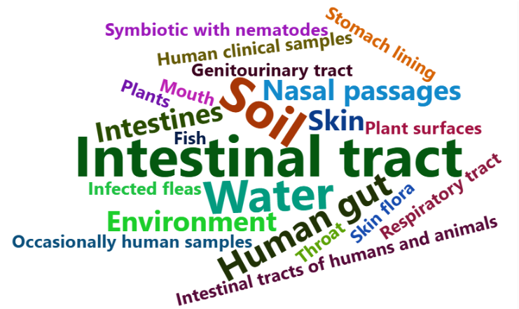

# harmful-bacteria-analysis-r

## About the Project

This project explores a public bacteria dataset using **R** to analyze bacterial species, their scientific classification, natural habitats, and potential impacts on human health.

The analysis includes **data cleaning, exploratory data analysis, and data visualization** to identify patterns and insights relevant to microbiology and public health.
Exploratory data analysis of a public bacteria dataset using R. The project includes data cleaning and visualization to examine bacterial species, their classification, natural habitats, and potential impacts on human health.

## Dataset

The **Bacteria Dataset**, made publicly available by Kanchana Karunarathna on Kaggle, contains information about different bacterial species, including their classification, habitat, and potential effects on human health.

During data exploration, duplicate records were identified and addressed. The dataset did not contain missing rows.

## Tools & Technologies

- **R**
- **Jupyter Notebook**
- **dplyr** – data manipulation
- **ggplot2** – data visualization
- **tidyr** – data cleaning and transformation
- **wordcloud2** – word cloud visualization

## Analysis

The project focuses on:

- Exploring the structure and quality of the dataset
- Cleaning and preparing the data for analysis
- Investigating bacterial classifications and characteristics
- Examining the natural habitats of harmful bacteria
- Exploring their potential effects on human health
- Visualizing patterns and distributions in the data

## Key Findings

The analysis shows that harmful bacteria occur across a variety of environments and host-associated habitats.

Among the most common locations identified in the dataset are **soil, water, and the intestinal tract**.

The analysis also highlights the diversity of bacterial species and their potential effects on human health.

## Bacterial Habitats

The word cloud below visualizes the most frequently occurring bacterial habitats in the dataset. Larger words represent more frequently reported locations.

## Project Files

- `harmful-bacteria-analysis.ipynb` – complete R analysis, including data cleaning, exploration, visualizations, and conclusions
- `images/` – selected visualizations used in the project README

## View the Analysis

The complete analysis is available in the Jupyter Notebook included in this repository.

The original project is also available on Kaggle:
https://www.kaggle.com/code/violettab/harmful-bacteria-analysis-with-r

## Author

**Violetta Basczok**

Data, Reporting & Visualization | R • SQL • Power BI • Excel • Tableau
